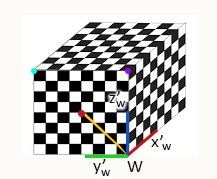
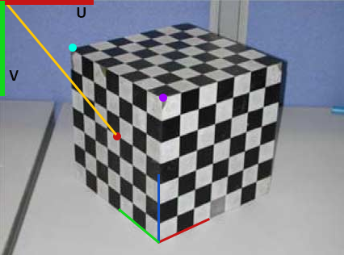

# Camera Calibration

The linear camera model allows us to calculate the projection of a point $P$ in camera space, we now need a method to estimate the projection matrix. Doing so requires an object of known geometry, for example, a cube.

  
**Figure 1:** Digital Cube

  
**Figure 2:** Cube Photo

In Figure 1, we have a cube of which we know all its dimensions and the position of every point on its surface.

If we consider a single point, a red point on the surface, we can encode it as:

```math
RedDot_{w} = \begin{bmatrix} x_{w} \\ y_{w} \\ z_{w} \end{bmatrix} = \begin{bmatrix} 0 \\ 3 \\ 3 \end{bmatrix}, \quad\mathrm{and}\quad RedDot_{u} = \begin{bmatrix} u \\ v \end{bmatrix} = \begin{bmatrix} 63 \\ 145 \end{bmatrix}
```

We can visualize the equivalent coordinates in 3D (expressed in mm) to 2D (expressed in pixels), and the next step is to repeat the process for different points in the object/photo. These extracted features are useful for calculating the projection matrix:

```math
\begin{bmatrix} u^{(i)} \\ v^{(i)} \\ 1 \end{bmatrix} \equiv \begin{bmatrix} p_{11} & p_{12} & p_{13} & p_{14} \\ p_{21} & p_{22} & p_{23} & p_{24} \\ p_{31} & p_{32} & p_{33} & p_{34} \end{bmatrix} \begin{bmatrix} x_{w}^{(i)} \\ y_{w}^{(i)} \\ z_{w}^{(i)} \\ 1 \end{bmatrix}
```

As a reminder, the $[u,v,1]$ and the $[x,y,z,1]$ vectors are known, while the $P$ vector is unknown. Expanding this in a linear equation system we get:

```math
    u^{(i)} = \frac{p_{11}x_{w}^{(i)} + p_{12}y_{w}^{(i)} + p_{13}z_{w}^{(i)} + p_{14}}{p_{31}x_{w}^{(i)} + p_{32}y_{w}^{(i)} + p_{33}z_{w}^{(i)} + p_{34}}
```

```math
    v^{(i)} = \frac{p_{21}x_{w}^{(i)} + p_{22}y_{w}^{(i)} + p_{23}z_{w}^{(i)} + p_{24}}{p_{31}x_{w}^{(i)} + p_{32}y_{w}^{(i)} + p_{33}z_{w}^{(i)} + p_{34}}
```

Rearranging the terms we get $AP = [0]$ where $A$ is known and $P$ is unknown:

```math
\begin{equation*}
    \begin{bmatrix}
    x_w^{(1)} & y_w^{(1)} & z_w^{(1)} & 1 & 0 & 0 & 0 & 0 & -u_1 x_w^{(1)} & -u_1y_w^{(1)} & -u_1z_w^{(1)} & -u_1 \\
    0 & 0 & 0 & 0 & x_w^{(1)} & y_w^{(1)} & z_w^{(1)} & 1 & -v_1 x_w^{(1)} & -v_1y_w^{(1)} & -v_1z_w^{(1)} & -v_1\\
    \vdots & \vdots & \vdots & \vdots & \vdots & \vdots & \vdots & \vdots & \vdots & \vdots & \vdots & \vdots & \\
    x_w^{(i)} & y_w^{(i)} & z_w^{(i)} & 1 & 0 & 0 & 0 & 0 & -u_i x_w^{(i)} & -u_iy_w^{(i)} & -u_iz_w^{(i)} & -u_i \\
    0 & 0 & 0 & 0 & x_w^{(i)} & y_w^{(i)} & z_w^{(i)} & 1 & -v_i x_w^{(i)} & -v_iy_w^{(i)} & -v_iz_w^{(i)} & -v_i\\
    \vdots & \vdots & \vdots & \vdots & \vdots & \vdots & \vdots & \vdots & \vdots & \vdots & \vdots & \vdots & \\
     x_w^{(n)} & y_w^{(n)} & z_w^{(n)} & 1 & 0 & 0 & 0 & 0 & -u_n x_w^{(n)} & -u_ny_w^{(n)} & -u_1z_w^{(n)} & -u_n \\
    0 & 0 & 0 & 0 & x_w^{(n)} & y_w^{(n)} & z_w^{(n)} & 1 & -v_n x_w^{(n)} & -v_ny_w^{(n)} & -v_1z_w^{(n)} & -v_n\\
    \end{bmatrix}
    \begin{bmatrix}
    p_{11} \\
    p_{12} \\
    p_{13} \\
    p_{14} \\
    p_{21} \\
    p_{22} \\
    p_{23} \\
    p_{24} \\
    p_{31} \\
    p_{32} \\
    p_{33} \\
    p_{34} \\
    \end{bmatrix}
    =
    \begin{bmatrix}
    0 \\
    0 \\
    0 \\
    0 \\
    0 \\
    0 \\
    0 \\
    0 \\
    0 \\
    0 \\
    \end{bmatrix}
\end{equation*}
```

A property of $P$ is related to its scale. We know that in homogeneous coordinates:

```math
    \begin{bmatrix} u' \\ v' \\ w' \end{bmatrix} \equiv k \begin{bmatrix} u' \\ v' \\ w' \end{bmatrix}
```

This means that both equal the same $uv$ coordinates. Then $P$ and $kP$ produce the same homogeneous coordinates, so the projection matrix is only defined up to a scale factor. Scaling the projection matrix implies simultaneously scaling the world camera, which does not change the final image. Therefore, we can set the scale of $P$ arbitrarily. An option is to set $||p||^2 = 1$ so we want to find:

```math
    \arg\min_p ||Ap||^2 \quad\mathrm{s.t.}\quad  ||p||^2 = 1
```

This is known as the Constrained Least Squares problem:

```math
    \arg\min_p (p^TA^TAp) \quad\mathrm{s.t.}\quad p^Tp=1
```

Defining a loss function $L(p,\lambda)$:

```math
L(p,\lambda) = p^TA^TAp - \lambda (p^Tp-1)
```

Taking the derivative of $L$ with respect to $p$:

```math
2A^T Ap - 2\lambda p = 0
```

Therefore, finding the $p$ that minimizes $L$ is equivalent to solving the Eigenvalue problem:

```math
A^T Ap=\lambda p
```

Summarizing, the $p$ we look for is the one with the smallest eigenvalue $\lambda$ of the matrix $A^T A$ that minimizes the loss function $L(p)$.

## Intrinsic and Extrinsic Decomposition

We know that the projection matrix $P$ that we can estimate using the calibration method is the product of $M_{int}$ and $M_{ext}$:

```math
    \begin{bmatrix} p_{11} & p_{12} & p_{13} & p_{14} \\ p_{21} & p_{22} & p_{23} & p_{24} \\ p_{31} & p_{32} & p_{33} & p_{34} \end{bmatrix} = \begin{bmatrix} f_x & 0 & o_x & 0 \\ 0 & f_y & o_y & 0 \\ 0 & 0 & 1 & 0 \end{bmatrix} \begin{bmatrix} r_{11} & r_{12} & r_{13} & t_x \\ r_{21} & r_{22} & r_{23} & t_y \\ r_{31} & r_{32} & r_{33} & t_z \\ 0 & 0 & 0 & 1 \end{bmatrix}
```

If we consider the submatrix:

```math
    \begin{bmatrix} p_{11} & p_{12} & p_{13} \\ p_{21} & p_{22} & p_{23} \\ p_{31} & p_{32} & p_{33} \end{bmatrix} = \begin{bmatrix} f_x & 0 & o_x \\ 0 & f_y & o_y \\ 0 & 0 & 1 \end{bmatrix} \begin{bmatrix} r_{11} & r_{12} & r_{13} \\ r_{21} & r_{22} & r_{23} \\ r_{31} & r_{32} & r_{33} \end{bmatrix} =KR
```

We can observe that the $K$ matrix is an *upper right triangular* matrix and $R$ is an orthonormal matrix. Using the **QR Factorization**, we can uniquely get the $K$ and $R$ matrices. 

To get the translation vector from $M_{ext}$:

```math
    \begin{bmatrix} p_{14} \\ p_{24} \\ p_{34} \end{bmatrix} = K \begin{bmatrix} t_{x} \\ t_{y} \\ t_{z} \end{bmatrix}
```

Since $K$ is known, we can now find the translation vector:

```math
    t=K^{-1} \begin{bmatrix} p_{14} \\ p_{24} \\ p_{34} \end{bmatrix}
```
